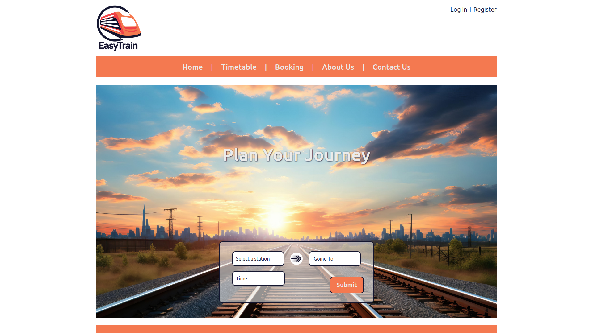
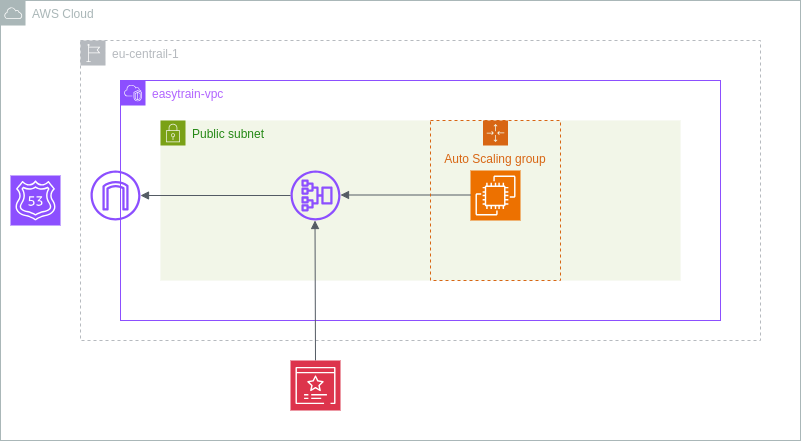

# EasyTrain: Train Booking Application


## A project by

    - Gabriele Jansen
    - Calton Manhique
    - Jacques Navarro
    - Kai Prager 

## Project Description

In today's fast-paced world, travelers face numerous challenges when booking train tickets, including long queues, inconvenient booking hours, and a lack of real-time information on train availability and schedules. Our efficient and user-friendly train booking application streamlines this process, providing a convenient solution for travelers to book tickets anytime, anywhere, with up-to-date information, reducing stress and enhancing the overall travel experience.

## Getting Started

### Prerequisites

- Java 17+
- Maven
- PostgreSQL
- MySQL
- IntelliJ IDEA (recommended)

### Installation

1. **Clone the repository:**
    ```bash
    git clone https://github.com/EasyTrain/application.git
    cd application
    ```

2. **Set up the PostgreSQL database:**
    - Install PostgreSQL.
    - Create a new database and configure it in `src/main/resources/application.properties`.

3. **Run the application:**
    ```bash
    mvn spring-boot:run
    ```

4. **Run additional database scripts**
    - `src/main/resources/database/easeytrain_db_schema.sql`
    - `src/main/resources/database/et_station_data.sql`
    - `src/main/resources/database/ice stations.sql`

## Usage

1. **Access the application:**
    Open your web browser and navigate to `http://localhost:8081/easytrain`.

2. **Create an account and log in**
    - Select "Register".
    - Fill out the form and follow further steps.
    - Log in, select "Settings" and complete your profile.
    - Additionally you can edit your profile, change your email or delete your accout.

3. **Booking tickets:**
    - Go to "Home" or "Booking".
    - Select a station, your destination and a time. 
    - Select a train and book your tickets.
    - Pay directly or pay later under "Settings -> Journeys"

4. **Check the timetables:**
    - Go to "Timetable"
    - Select a station and a time

5. **Simulate Payments**
    - To simulate payments, run api-payments `https://github.com/EasyTrain/api-payments`

## Technologies Used

### Backend
- Java
- Spring Boot
- Maven

### Frontend
- HTML
- CSS
- Bootstrap
- JavaScript

### Database Management
- PostgreSQL
- pgAdmin
- MySQL
- MySQL Workbench
- DB Timetables API

### Web Services
- Jakarta EE (JAX-WS)

### Cloud Services

- Amazon Web Services
- Terraform
- Packer



## License

This project is licensed under the [MIT License](https://opensource.org/licenses/MIT).

You are free to use, modify, and distribute this software under the terms of the MIT License. See the LICENSE file for more details

## Acknowledgements

The project was created as a final project for DCI - Digital Career Institute. Special thanks to our teachers Bardha Islami, Nootan Vijapure, and our mentor Safwan Kherallah.
